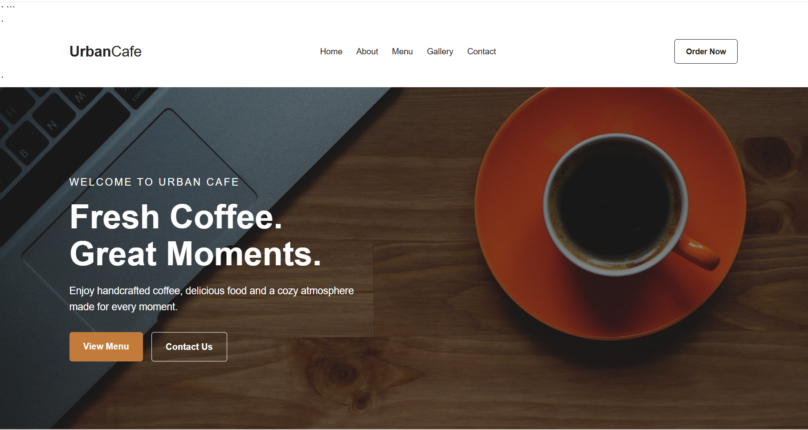
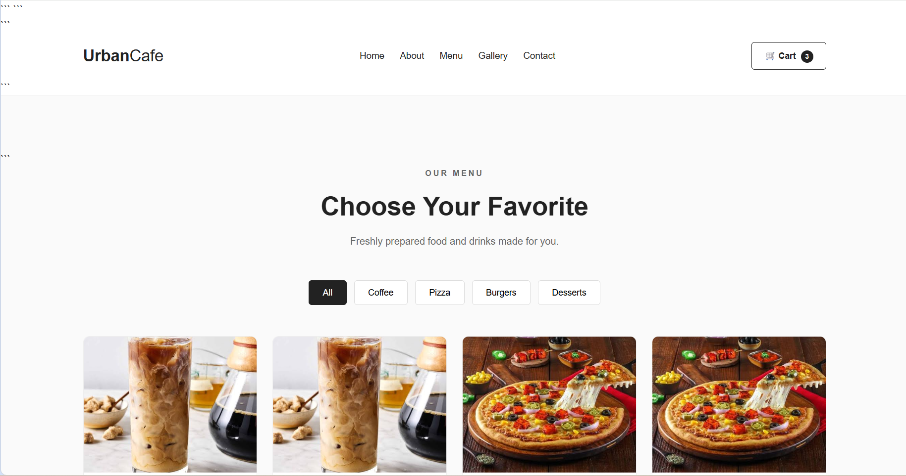
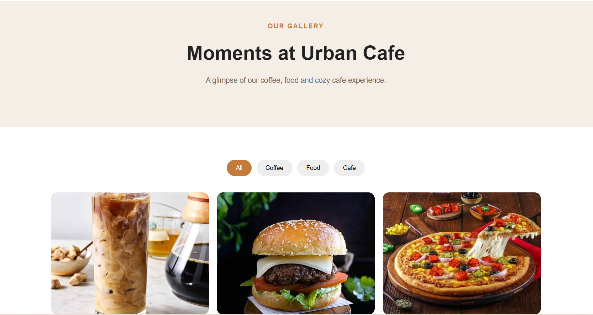
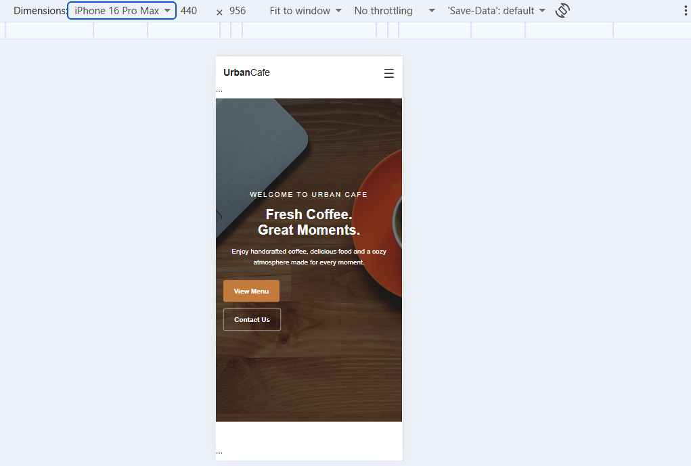

# ☕ Urban Cafe

A modern, responsive cafe website built with HTML5, CSS3 and Vanilla JavaScript.

## 🌐 Live Demo

https://pbhardwaz9060-prog.github.io/urban-cafe/

## 📌 About The Project

Urban Cafe is a modern business website concept designed for cafes and restaurants.

The project focuses on creating a clean, responsive and user-friendly experience across desktop, tablet and mobile devices.

## ✨ Features

- Responsive design
- Mobile hamburger navigation
- Modern hero section
- Featured products
- Menu category filtering
- Add to cart functionality
- Increase/decrease product quantity
- Remove items from cart
- Clear cart
- LocalStorage cart persistence
- Order/checkout page
- WhatsApp ordering
- Gallery filtering
- Contact form
- Google Maps integration
- Back-to-top button
- Smooth scrolling
- Scroll reveal animations
- Hover effects
- SEO-friendly page titles and descriptions

## 🛠️ Technologies

- HTML5
- CSS3
- JavaScript
- LocalStorage
- Google Maps
- WhatsApp

## 📂 Project Structure

urban-cafe/
│
├── index.html
├── about.html
├── menu.html
├── gallery.html
├── contact.html
├── order.html
│
├── css/
│   └── style.css
│
├── js/
│   ├── main.js
│   ├── menu.js
│   └── cart.js
│
├── images/
│
├── README.md
└── LICENSE

## 🛒 Cart System

The shopping cart is implemented using JavaScript and browser LocalStorage.

Users can:

- Add products
- Change quantity
- Remove products
- Clear the cart
- Continue to checkout

## 📱 Responsive Design

The website has been optimized for:

- Mobile devices
- Tablets
- Desktop screens

## 📸 Screenshots

Screenshots of the project will be added here.

## 🚀 Future Improvements

- Online payment gateway
- Backend integration
- Database
- Admin dashboard
- Customer authentication
- Online table reservation
- Order tracking
- Product search
- Real-time notifications

## 👩‍💻 Developer

**Pragati Bhardwaj**

Frontend Web Developer

### Skills Demonstrated

HTML • CSS • JavaScript • Responsive Design • LocalStorage • Git • GitHub

## 📄 License

This project is created for portfolio and demonstration purposes.

## 📸 Screenshots:

